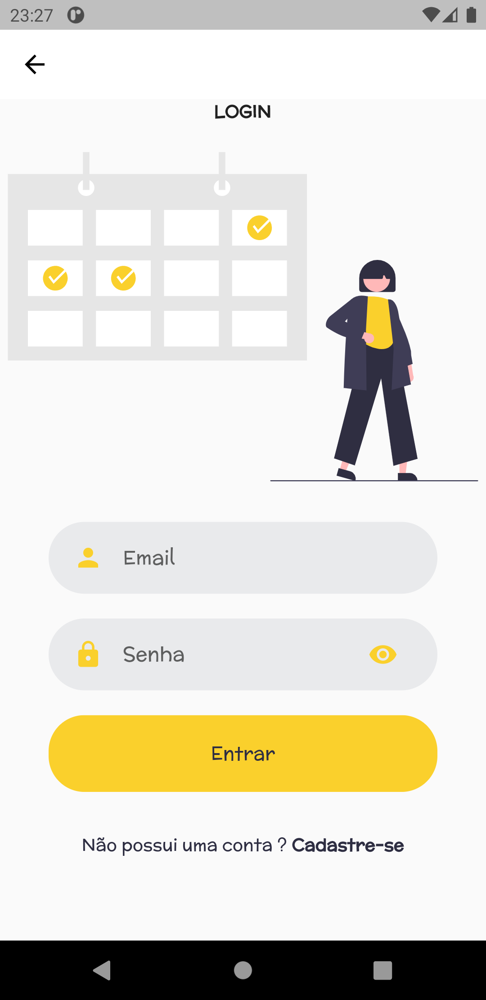

# AgendAapp

Eventos dinâmicos no calendário usando o pacote table_calendar e integração com o firebase.

Assets usados: https://undraw.co/illustrations

## Getting Started

 
  
  
  

## Meus eventos Screens

        
